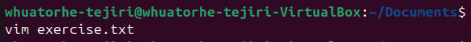
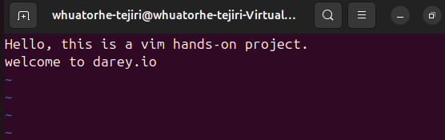
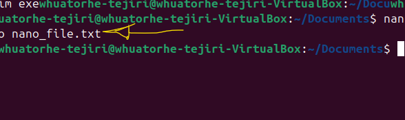
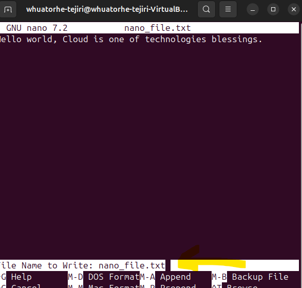

# Popular Linux Test Editors

Linux text editors is a software application designed for editing text files, writing codes, updating user instruction files, and more. Linux text editors are essential tools that play a crucial role in various tasks, from coding and writing to system administration and configuration management. Linux offers a wide range of text editors, catering to different preferences and use cases. We look at two popular editors for this project.

 **Vim Editor**

This is one of the popular linux editor, short for "Vi improved" Vim build upon the foundation of the originl Vi editor, its compatibility makes it a favourite among tech professionals and anyone working extensively with text files.

The below command creates a text file named "exercise.txt" if it doesn't exist and opens the file for editing.

Once inside the file, press i to enter edit mode and edit the document as neccessary. There are several commands to manipulate the documents which includes pressing esc key to leave the insert mode and highligting a line and pressing 'd' twice to delete. To undo, press 'u' in the normal mode.
To save the document press, ensure to leave the insert mode and press ":wq" and then Enter - w means save, while q means quit, to go back to the directory. To quit without saving simply press :q! and then Enter.

**Nano Text Editor**

Nano stands out as a user-friendly and straightforward tool , making it an excellent choice for users who are new to command line or those prefering a more intuitive editing experience. Its intuitive command set simplifies text manipulation tasks, allowing users to navigate through files, insert or delete text, and save changes effortlessly.

To edit a file we use the nano command *"nano 'file_name.txt'"*, this opens the file straight to start editing or creates the file if the name doesn't exist and opens the file.

To save the file, press *'ctrl + o'* and then Enter button, *'ctrl + x'* is used to exit, if there are any unsaved changes, nano will promt to save.

